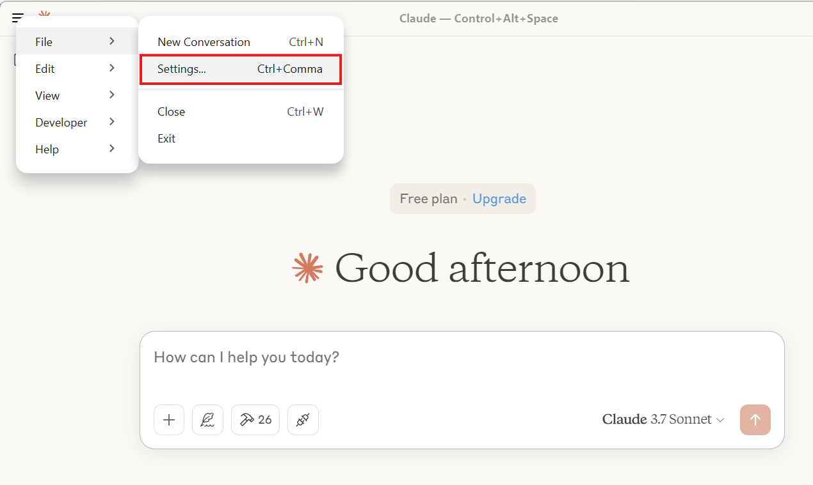
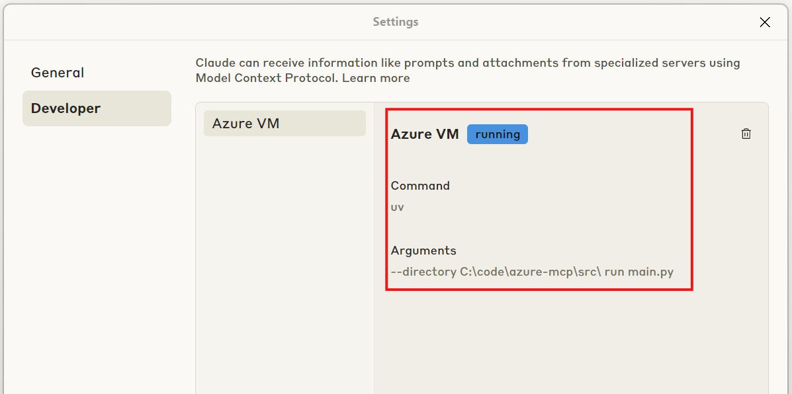

# Azure VM Management MCP

A Python-based demo tool for managing Azure VMs using the MCP (Model-Context Protocol). This project provides a simple interface to create, list, and delete Azure VMs along with their associated network resources.

## Prerequisites

- Python 3.13 or higher
- Azure subscription
- Azure CLI (for authentication)

## Installation

1. Clone this repository:
```sh
git clone https://github.com/brauliomsft/azure-mcp
cd azure-mcp
```

2. Install uv and set up the Python project and environment
```sh
powershell -ExecutionPolicy ByPass -c "irm https://astral.sh/uv/install.ps1 | iex"
```

3. Create and activate a virtual environment:
```sh
uv venv
.venv\Scripts\activate
```

4. Install dependencies:
```sh
pip install -r src/requirements.txt
```

## Configuration

1. Copy the example environment file:
```sh
cp src/.env.example src/.env
```

2. Update the `.env` file with your Azure credentials:
```
AZURE_RESOURCE_GROUP = "your-resource-group"
AZURE_LOCATION = "your-location"
SUBSCRIPTION_ID = "your-subscription-id"
```

## Available Commands

The project provides the following MCP tools:

- `list_vms`: Lists all VMs in the specified resource group
- `create_vm`: Creates a new Ubuntu 18.04 VM with basic networking setup
- `delete_vm`: Deletes a VM and its associated network resources

## Usage

Run the MCP server:

```sh
uv run .\src\main.py
```

## MCP Client Configuration (For Claude)
### Claude
1. Navigate to Claude Configuration file (`C:\Users\<user>\AppData\Roaming\Claude for Windows`)
2. Add the following text to the claude_desktop_config.json file. **Make sure to use the full path on your local machine. Eg. 'C:\\code\\azure-mcp\\src**'
```sh
{
  "mcpServers": {
    "Azure VM": {
      "command": "uv",
      "args": [
        "--directory",
        "<FULL_PATH\\>azure-mcp\\src\\",
        "run",
        "main.py"
      ]
    }
  }
}
```
3. Validate that Claude is now connected to the MCP Server. Open Claude App and Navigate to File -> Settings. The "Azure MCP" Server should show as Running in the Developer tab






## Project Structure

```
├── src/
│   ├── azure_clients.py    # Azure SDK client initialization
│   ├── networking.py       # Network resource management
│   ├── vm_operations.py    # VM management operations
│   └── main.py            # Entry point
├── pyproject.toml         # Project dependencies and metadata
└── README.md
```

## Security Note

⚠️ The default VM configuration uses a hardcoded password. For production use, modify the `create_vm` function in `vm_operations.py` to use more secure authentication methods.

